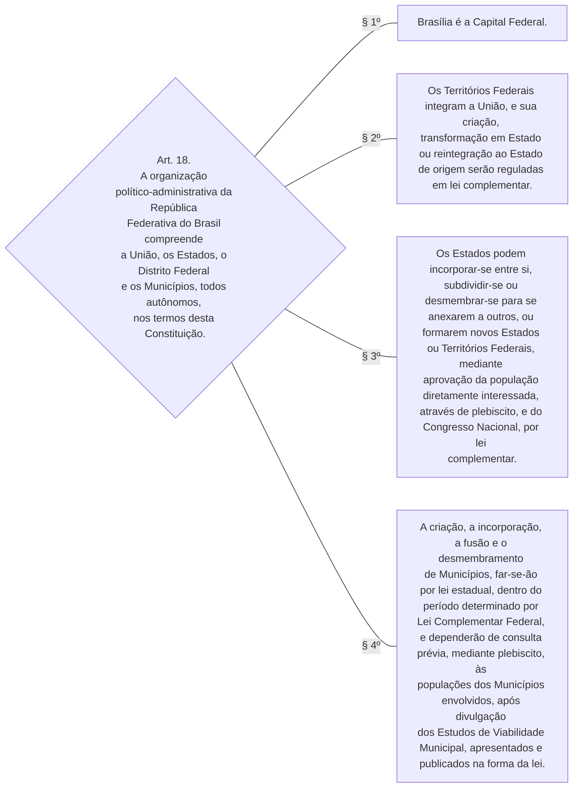
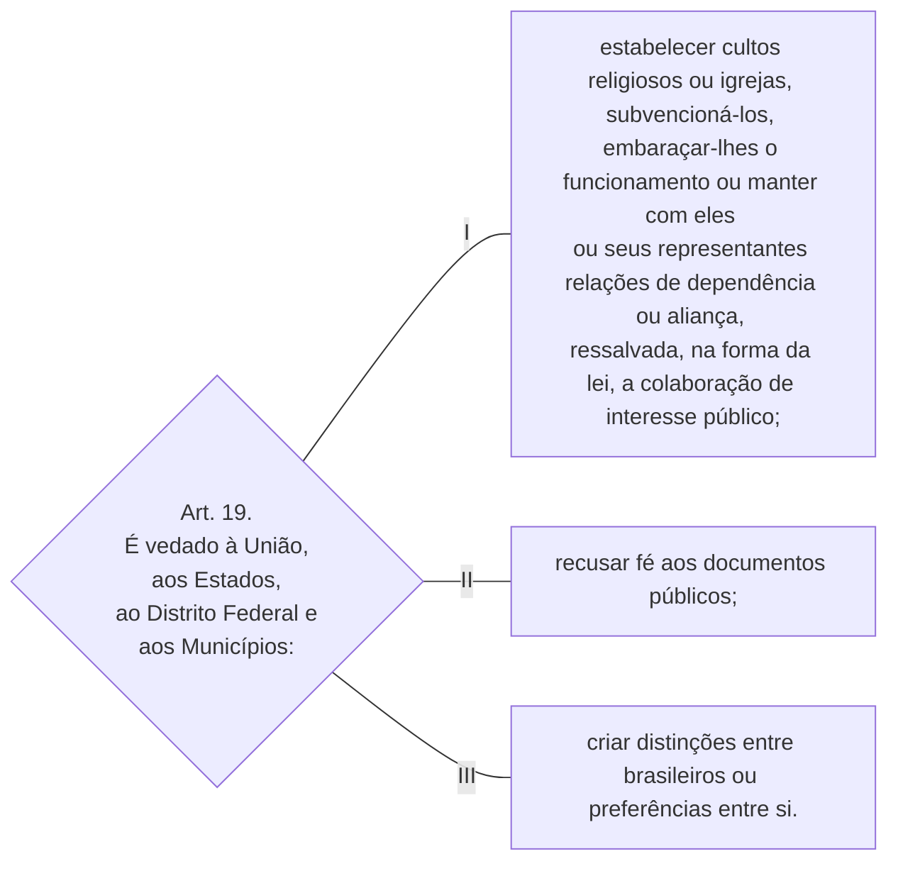

TÍTULO III

Da Organização do Estado

CAPÍTULO I

DA ORGANIZAÇÃO POLÍTICO-ADMINISTRATIVA

Art. 18. A organização político-administrativa da República Federativa do Brasil compreende a União, os Estados, o Distrito Federal e os Municípios, todos autônomos, nos termos desta Constituição.

§ 1º Brasília é a Capital Federal.

§ 2º Os Territórios Federais integram a União, e sua criação, transformação em Estado ou reintegração ao Estado de origem serão reguladas em lei complementar.

§ 3º Os Estados podem incorporar-se entre si, subdividir-se ou desmembrar-se para se anexarem a outros, ou formarem novos Estados ou Territórios Federais, mediante aprovação da população diretamente interessada, através de plebiscito, e do Congresso Nacional, por lei complementar.

§ 4º A criação, a incorporação, a fusão e o desmembramento de Municípios, far-se-ão por lei estadual, dentro do período determinado por Lei Complementar Federal, e dependerão de consulta prévia, mediante plebiscito, às populações dos Municípios envolvidos, após divulgação dos Estudos de Viabilidade Municipal, apresentados e publicados na forma da lei.        [(Redação dada pela Emenda Constitucional nº 15, de 1996)](http://www.planalto.gov.br/ccivil_03/constituicao/Emendas/Emc/emc15.htm#art1)

Art. 19. É vedado à União, aos Estados, ao Distrito Federal e aos Municípios:

I - estabelecer cultos religiosos ou igrejas, subvencioná-los, embaraçar-lhes o funcionamento ou manter com eles ou seus representantes relações de dependência ou aliança, ressalvada, na forma da lei, a colaboração de interesse público;

II - recusar fé aos documentos públicos;

III - criar distinções entre brasileiros ou preferências entre si.

 

TÍTULO III

Da Organização do Estado

CAPÍTULO I

DA ORGANIZAÇÃO POLÍTICO-ADMINISTRATIVA

 