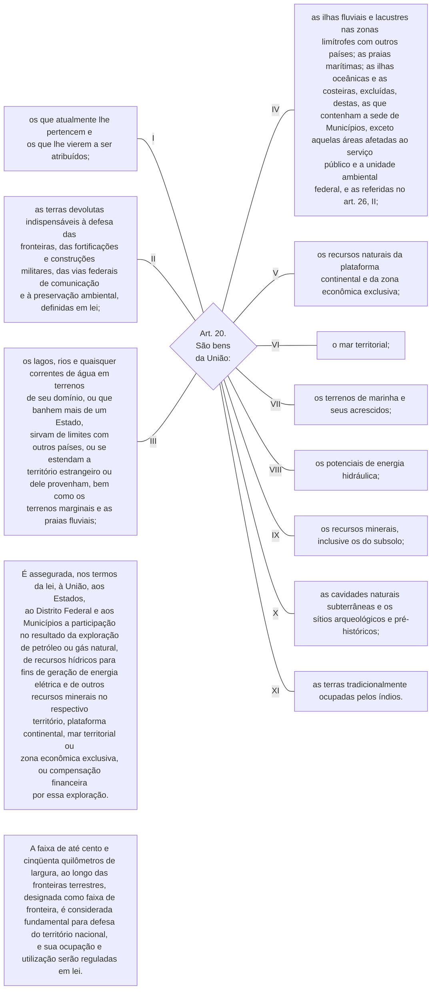

TÍTULO III

Da Organização do Estado

CAPÍTULO II

DA UNIÃO

Art. 20. São bens da União: 

I - os que atualmente lhe pertencem e os que lhe vierem a ser atribuídos;

II - as terras devolutas indispensáveis à defesa das fronteiras, das fortificações e construções militares, das vias federais de comunicação e à preservação ambiental, definidas em lei; 

III - os lagos, rios e quaisquer correntes de água em terrenos de seu domínio, ou que banhem mais de um Estado, sirvam de limites com outros países, ou se estendam a território estrangeiro ou dele provenham, bem como os terrenos marginais e as praias fluviais;

IV as ilhas fluviais e lacustres nas zonas limítrofes com outros países; as praias marítimas; as ilhas oceânicas e as costeiras, excluídas, destas, as que contenham a sede de Municípios, exceto aquelas áreas afetadas ao serviço público e a unidade ambiental federal, e as referidas no art. 26, II;         [(Redação dada pela Emenda Constitucional nº 46, de 2005)](http://www.planalto.gov.br/ccivil_03/constituicao/Emendas/Emc/emc46.htm#art1)

V - os recursos naturais da plataforma continental e da zona econômica exclusiva;

VI - o mar territorial; 

VII - os terrenos de marinha e seus acrescidos;

VIII - os potenciais de energia hidráulica;

IX - os recursos minerais, inclusive os do subsolo;

X - as cavidades naturais subterrâneas e os sítios arqueológicos e pré-históricos;

XI - as terras tradicionalmente ocupadas pelos índios.

§ 1º É assegurada, nos termos da lei, à União, aos Estados, ao Distrito Federal e aos Municípios a participação no resultado da exploração de petróleo ou gás natural, de recursos hídricos para fins de geração de energia elétrica e de outros recursos minerais no respectivo território, plataforma continental, mar territorial ou zona econômica exclusiva, ou compensação financeira por essa exploração.      [(Redação dada pela Emenda Constitucional nº 102, de 2019)](http://www.planalto.gov.br/ccivil_03/constituicao/Emendas/Emc/emc102.htm#art1)   [(Produção de efeito)](http://www.planalto.gov.br/ccivil_03/constituicao/Emendas/Emc/emc102.htm#art4)

§ 2º A faixa de até cento e cinqüenta quilômetros de largura, ao longo das fronteiras terrestres, designada como faixa de fronteira, é considerada fundamental para defesa do território nacional, e sua ocupação e utilização serão reguladas em lei.

[…]

TÍTULO III

Da Organização do Estado

CAPÍTULO II

DA UNIÃO

[…]

[…]

