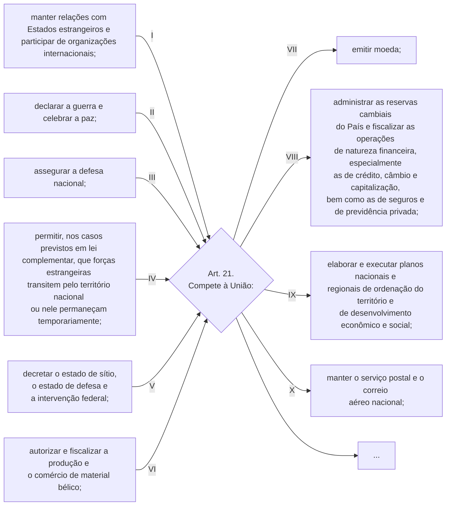
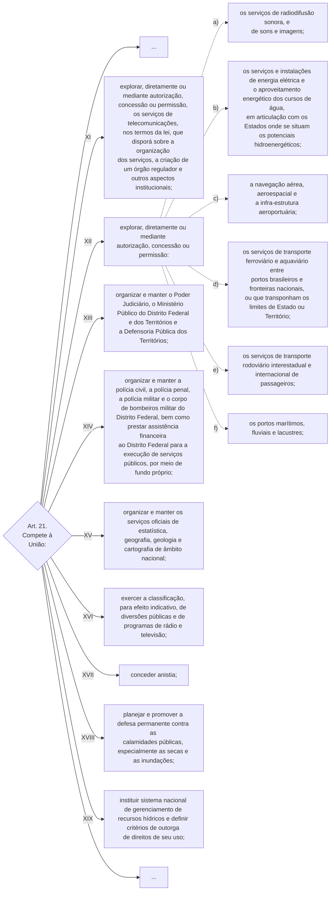
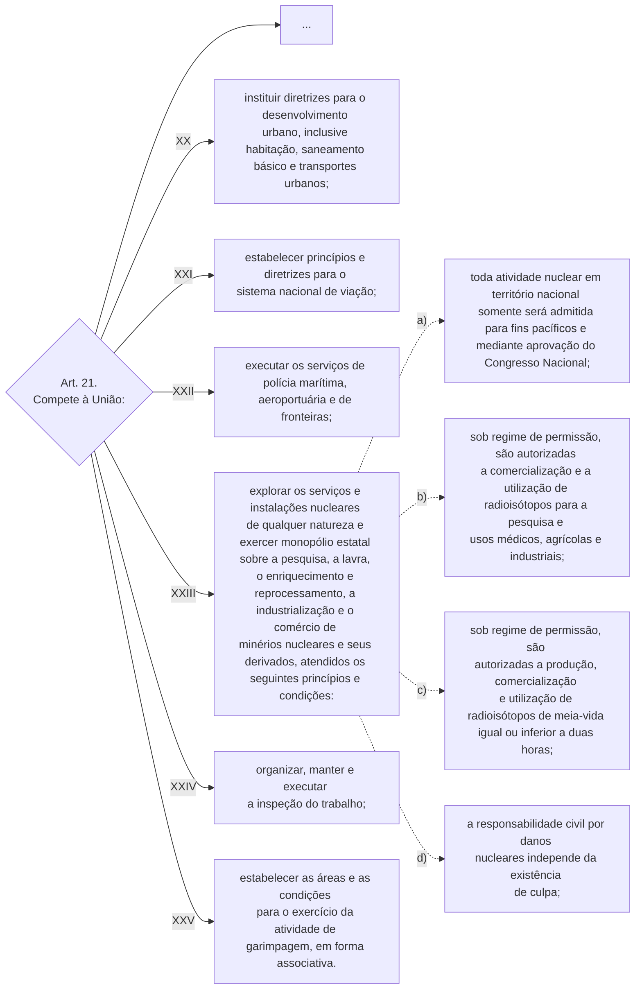

TÍTULO III

Da Organização do Estado

[…]

CAPÍTULO II

DA UNIÃO

[…]

Art. 21. Compete à União:

I - manter relações com Estados estrangeiros e participar de organizações internacionais;

II - declarar a guerra e celebrar a paz;

III - assegurar a defesa nacional;

IV - permitir, nos casos previstos em lei complementar, que forças estrangeiras transitem pelo território nacional ou nele permaneçam temporariamente;

V - decretar o estado de sítio, o estado de defesa e a intervenção federal;

VI - autorizar e fiscalizar a produção e o comércio de material bélico;

VII - emitir moeda;

VIII - administrar as reservas cambiais do País e fiscalizar as operações de natureza financeira, especialmente as de crédito, câmbio e capitalização, bem como as de seguros e de previdência privada;

IX - elaborar e executar planos nacionais e regionais de ordenação do território e de desenvolvimento econômico e social;

X - manter o serviço postal e o correio aéreo nacional; 

XI - explorar, diretamente ou mediante autorização, concessão ou permissão, os serviços de telecomunicações, nos termos da lei, que disporá sobre a organização dos serviços, a criação de um órgão regulador e outros aspectos institucionais;      [(Redação dada pela Emenda Constitucional nº 8, de 15/08/95:)](http://www.planalto.gov.br/ccivil_03/constituicao/Emendas/Emc/emc08.htm#art1)

XII - explorar, diretamente ou mediante autorização, concessão ou permissão:

a) os serviços de radiodifusão sonora, e de sons e imagens;       [(Redação dada pela Emenda Constitucional nº 8, de 15/08/95:)](http://www.planalto.gov.br/ccivil_03/constituicao/Emendas/Emc/emc08.htm#art1)

b) os serviços e instalações de energia elétrica e o aproveitamento energético dos cursos de água, em articulação com os Estados onde se situam os potenciais hidroenergéticos; 

c) a navegação aérea, aeroespacial e a infra-estrutura aeroportuária;

d) os serviços de transporte ferroviário e aquaviário entre portos brasileiros e fronteiras nacionais, ou que transponham os limites de Estado ou Território;

e) os serviços de transporte rodoviário interestadual e internacional de passageiros;

f) os portos marítimos, fluviais e lacustres;

XIII - organizar e manter o Poder Judiciário, o Ministério Público do Distrito Federal e dos Territórios e a Defensoria Pública dos Territórios;       [(Redação dada pela Emenda Constitucional nº 69, de 2012)](http://www.planalto.gov.br/ccivil_03/constituicao/Emendas/Emc/emc69.htm#art1)    [(Produção de efeito)](http://www.planalto.gov.br/ccivil_03/constituicao/Emendas/Emc/emc69.htm#art4) 

XIV - organizar e manter a polícia civil, a polícia penal, a polícia militar e o corpo de bombeiros militar do Distrito Federal, bem como prestar assistência financeira ao Distrito Federal para a execução de serviços públicos, por meio de fundo próprio;      [(Redação dada pela Emenda Constitucional nº 104, de 2019) ](http://www.planalto.gov.br/ccivil_03/constituicao/Emendas/Emc/emc104.htm#art1)

XV - organizar e manter os serviços oficiais de estatística, geografia, geologia e cartografia de âmbito nacional;

XVI - exercer a classificação, para efeito indicativo, de diversões públicas e de programas de rádio e televisão;

XVII - conceder anistia;

XVIII - planejar e promover a defesa permanente contra as calamidades públicas, especialmente as secas e as inundações;

XIX - instituir sistema nacional de gerenciamento de recursos hídricos e definir critérios de outorga de direitos de seu uso;     ([Regulamento](http://www.planalto.gov.br/ccivil_03/LEIS/L9433.htm))

XX - instituir diretrizes para o desenvolvimento urbano, inclusive habitação, saneamento básico e transportes urbanos;

XXI - estabelecer princípios e diretrizes para o sistema nacional de viação;

XXII - executar os serviços de polícia marítima, aeroportuária e de fronteiras;      [(Redação dada pela Emenda Constitucional nº 19, de 1998)](http://www.planalto.gov.br/ccivil_03/constituicao/Emendas/Emc/emc19.htm#art1)

XXIII - explorar os serviços e instalações nucleares de qualquer natureza e exercer monopólio estatal sobre a pesquisa, a lavra, o enriquecimento e reprocessamento, a industrialização e o comércio de minérios nucleares e seus derivados, atendidos os seguintes princípios e condições:

a) toda atividade nuclear em território nacional somente será admitida para fins pacíficos e mediante aprovação do Congresso Nacional;

b) sob regime de permissão, são autorizadas a comercialização e a utilização de radioisótopos para a pesquisa e usos médicos, agrícolas e industriais;        [(Redação dada pela Emenda Constitucional nº 49, de 2006)](http://www.planalto.gov.br/ccivil_03/constituicao/Emendas/Emc/emc49.htm#art1)

c) sob regime de permissão, são autorizadas a produção, comercialização e utilização de radioisótopos de meia-vida igual ou inferior a duas horas;         [(Redação dada pela Emenda Constitucional nº 49, de 2006)](http://www.planalto.gov.br/ccivil_03/constituicao/Emendas/Emc/emc49.htm#art1)

d) a responsabilidade civil por danos nucleares independe da existência de culpa;         [(Redação dada pela Emenda Constitucional nº 49, de 2006)](http://www.planalto.gov.br/ccivil_03/constituicao/Emendas/Emc/emc49.htm#art1)

XXIV - organizar, manter e executar a inspeção do trabalho;

XXV - estabelecer as áreas e as condições para o exercício da atividade de garimpagem, em forma associativa.

[…]

TÍTULO III

Da Organização do Estado

[…]

CAPÍTULO II

DA UNIÃO

[…]

