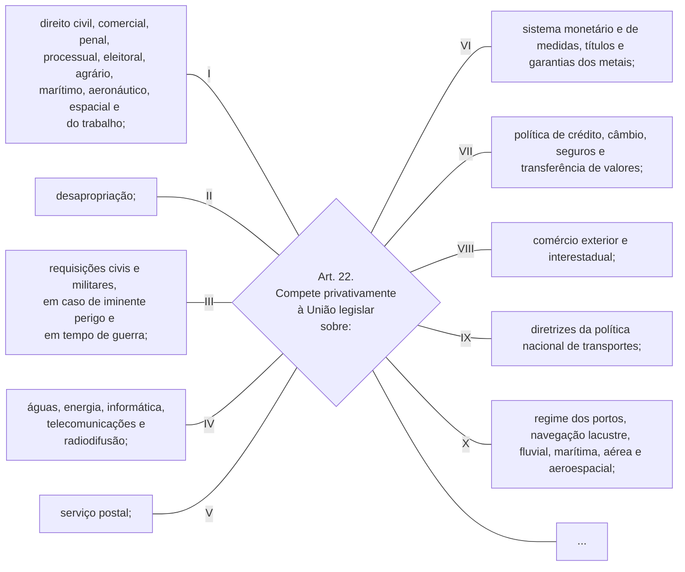
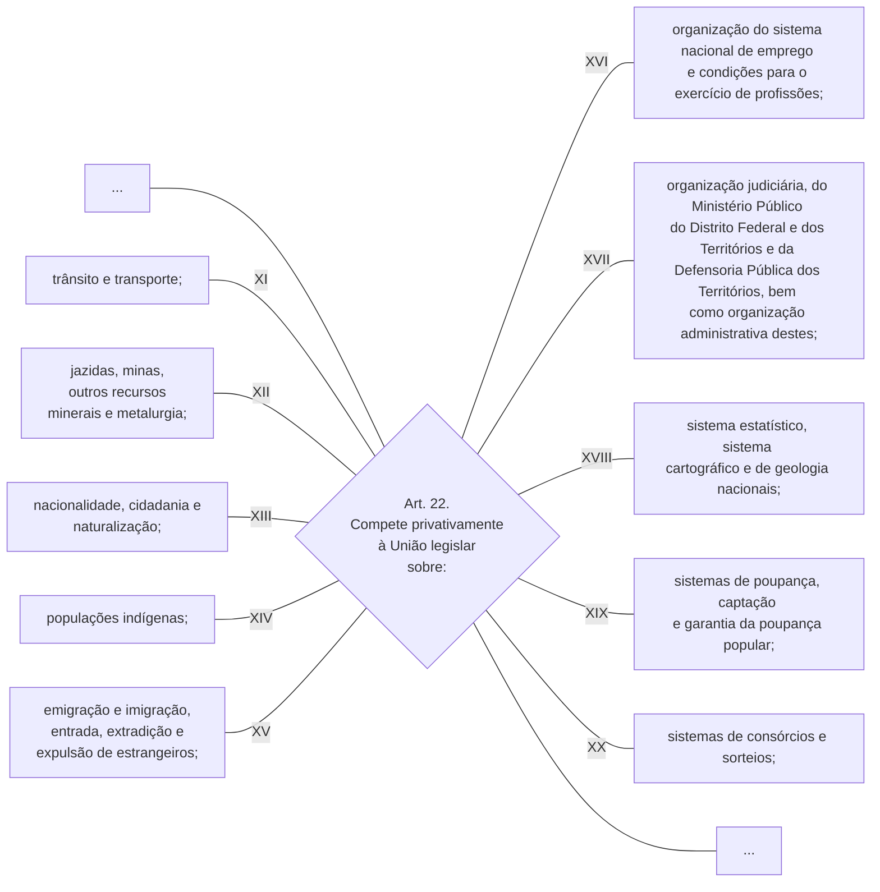
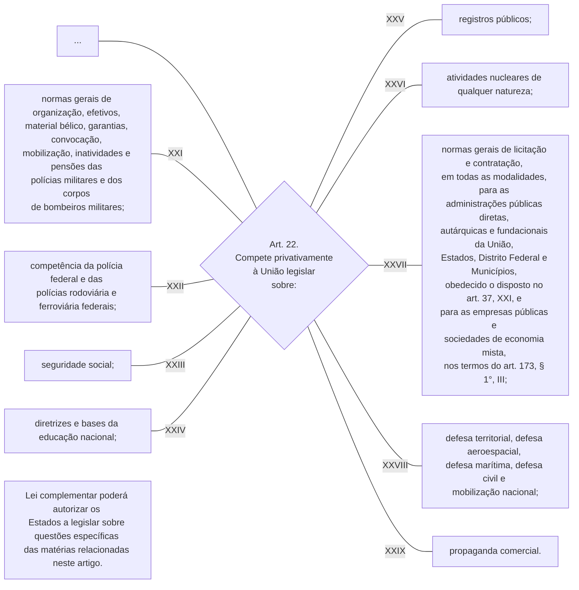

TÍTULO III

Da Organização do Estado

[…]

CAPÍTULO II

DA UNIÃO

[…]

Art. 22. Compete privativamente à União legislar sobre:

I - direito civil, comercial, penal, processual, eleitoral, agrário, marítimo, aeronáutico, espacial e do trabalho;

II - desapropriação;

III - requisições civis e militares, em caso de iminente perigo e em tempo de guerra;

IV - águas, energia, informática, telecomunicações e radiodifusão;

V - serviço postal;

VI - sistema monetário e de medidas, títulos e garantias dos metais;

VII - política de crédito, câmbio, seguros e transferência de valores;

VIII - comércio exterior e interestadual;

IX - diretrizes da política nacional de transportes;

X - regime dos portos, navegação lacustre, fluvial, marítima, aérea e aeroespacial;

XI - trânsito e transporte;

XII - jazidas, minas, outros recursos minerais e metalurgia;

XIII - nacionalidade, cidadania e naturalização; 

XIV - populações indígenas; 

XV - emigração e imigração, entrada, extradição e expulsão de estrangeiros; 

XVI - organização do sistema nacional de emprego e condições para o exercício de profissões;

XVII - organização judiciária, do Ministério Público do Distrito Federal e dos Territórios e da Defensoria Pública dos Territórios, bem como organização administrativa destes;         [(Redação dada pela Emenda Constitucional nº 69, de 2012)](http://www.planalto.gov.br/ccivil_03/constituicao/Emendas/Emc/emc69.htm#art1)     [(Produção de efeito)](http://www.planalto.gov.br/ccivil_03/constituicao/Emendas/Emc/emc69.htm#art4)

XVIII - sistema estatístico, sistema cartográfico e de geologia nacionais;

XIX - sistemas de poupança, captação e garantia da poupança popular; 

XX - sistemas de consórcios e sorteios; 

XXI - normas gerais de organização, efetivos, material bélico, garantias, convocação, mobilização, inatividades e pensões das polícias militares e dos corpos de bombeiros militares;        [(Redação dada pela Emenda Constitucional nº 103, de 2019)](http://www.planalto.gov.br/ccivil_03/constituicao/Emendas/Emc/emc103.htm#art1)

XXII - competência da polícia federal e das polícias rodoviária e ferroviária federais; 

XXIII - seguridade social; 

XXIV - diretrizes e bases da educação nacional;

XXV - registros públicos; 

XXVI - atividades nucleares de qualquer natureza;

XXVII – normas gerais de licitação e contratação, em todas as modalidades, para as administrações públicas diretas, autárquicas e fundacionais da União, Estados, Distrito Federal e Municípios, obedecido o disposto no art. 37, XXI, e para as empresas públicas e sociedades de economia mista, nos termos do art. 173, § 1°, III;        [(Redação dada pela Emenda Constitucional nº 19, de 1998)](http://www.planalto.gov.br/ccivil_03/constituicao/Emendas/Emc/emc19.htm#art1)

XXVIII - defesa territorial, defesa aeroespacial, defesa marítima, defesa civil e mobilização nacional;

XXIX - propaganda comercial. 

Parágrafo único. Lei complementar poderá autorizar os Estados a legislar sobre questões específicas das matérias relacionadas neste artigo.

[…]

TÍTULO III

Da Organização do Estado

[…]

CAPÍTULO II

DA UNIÃO

[…]

[…]