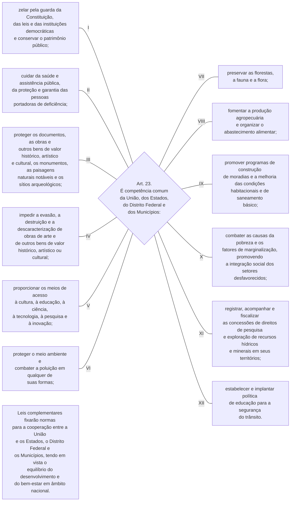

TÍTULO III

Da Organização do Estado

CAPÍTULO II

DA UNIÃO

[…]

CAPÍTULO II

DA UNIÃO

[…]

Art. 23. É competência comum da União, dos Estados, do Distrito Federal e dos Municípios:

I - zelar pela guarda da Constituição, das leis e das instituições democráticas e conservar o patrimônio público;

II - cuidar da saúde e assistência pública, da proteção e garantia das pessoas portadoras de deficiência;   [(Vide ADPF 672)](http://www.stf.jus.br/portal/peticaoInicial/verPeticaoInicial.asp?base=ADPF&documento=&s1=672&numProcesso=672)

III - proteger os documentos, as obras e outros bens de valor histórico, artístico e cultural, os monumentos, as paisagens naturais notáveis e os sítios arqueológicos; 

IV - impedir a evasão, a destruição e a descaracterização de obras de arte e de outros bens de valor histórico, artístico ou cultural;

V - proporcionar os meios de acesso à cultura, à educação, à ciência, à tecnologia, à pesquisa e à inovação;        [(Redação dada pela Emenda Constitucional nº 85, de 2015)](http://www.planalto.gov.br/ccivil_03/constituicao/Emendas/Emc/emc85.htm#art1) 

VI - proteger o meio ambiente e combater a poluição em qualquer de suas formas; 

VII - preservar as florestas, a fauna e a flora;

VIII - fomentar a produção agropecuária e organizar o abastecimento alimentar;

IX - promover programas de construção de moradias e a melhoria das condições habitacionais e de saneamento básico;    [(Vide ADPF 672)](http://www.stf.jus.br/portal/peticaoInicial/verPeticaoInicial.asp?base=ADPF&documento=&s1=672&numProcesso=672)

X - combater as causas da pobreza e os fatores de marginalização, promovendo a integração social dos setores desfavorecidos;

XI - registrar, acompanhar e fiscalizar as concessões de direitos de pesquisa e exploração de recursos hídricos e minerais em seus territórios;

XII - estabelecer e implantar política de educação para a segurança do trânsito.

Parágrafo único. Leis complementares fixarão normas para a cooperação entre a União e os Estados, o Distrito Federal e os Municípios, tendo em vista o equilíbrio do desenvolvimento e do bem-estar em âmbito nacional.       [(Redação dada pela Emenda Constitucional nº 53, de 2006)](http://www.planalto.gov.br/ccivil_03/constituicao/Emendas/Emc/emc53.htm#art1)

[…]

TÍTULO III

Da Organização do Estado

CAPÍTULO II

DA UNIÃO

[…]

CAPÍTULO II

DA UNIÃO

[…]

[…]

