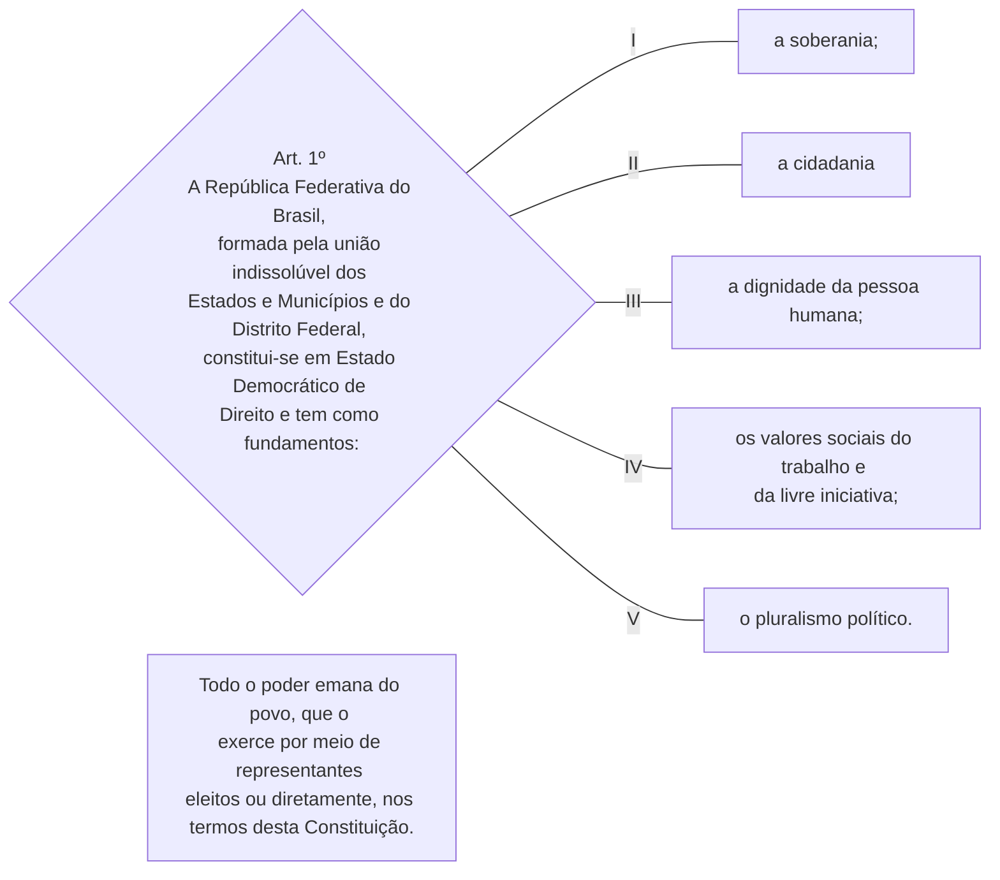
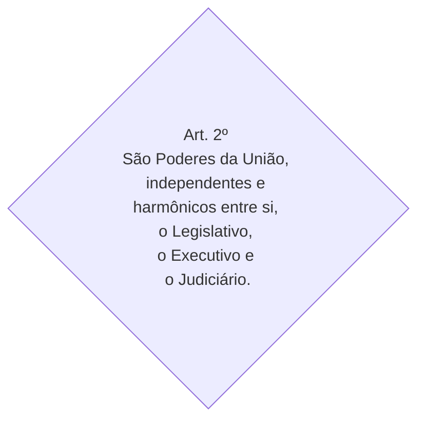
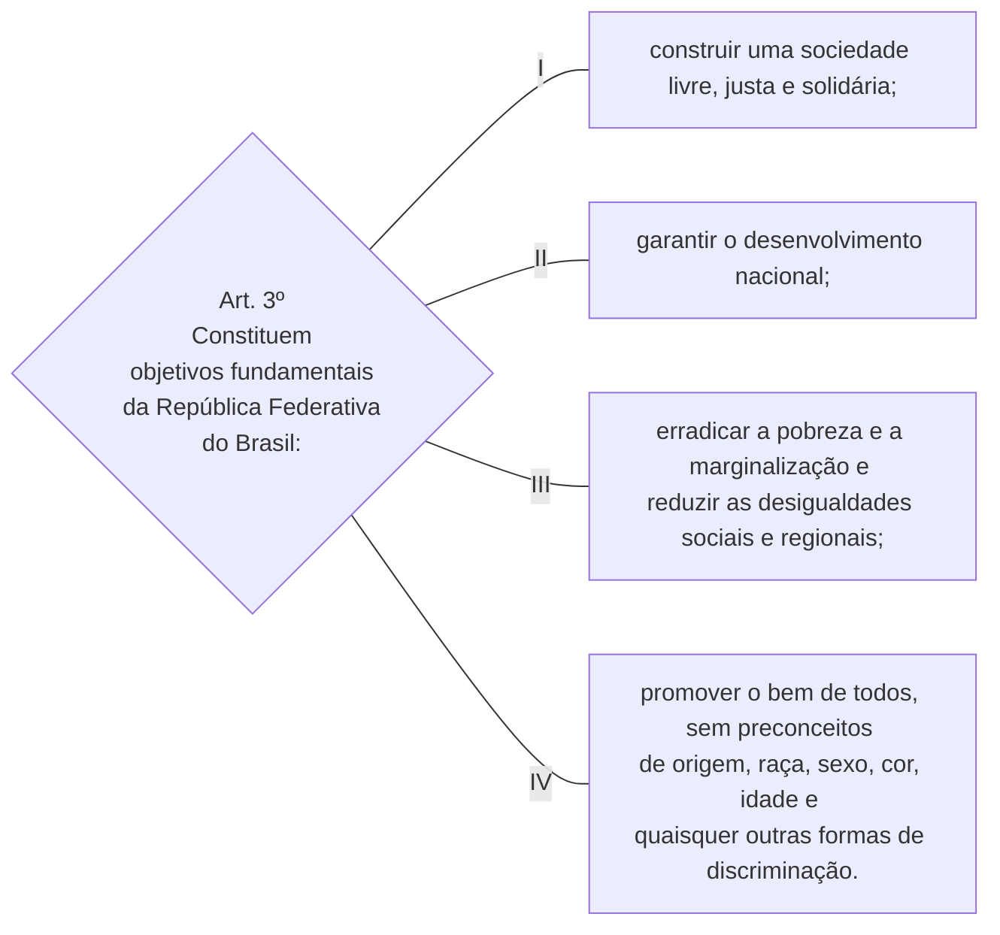
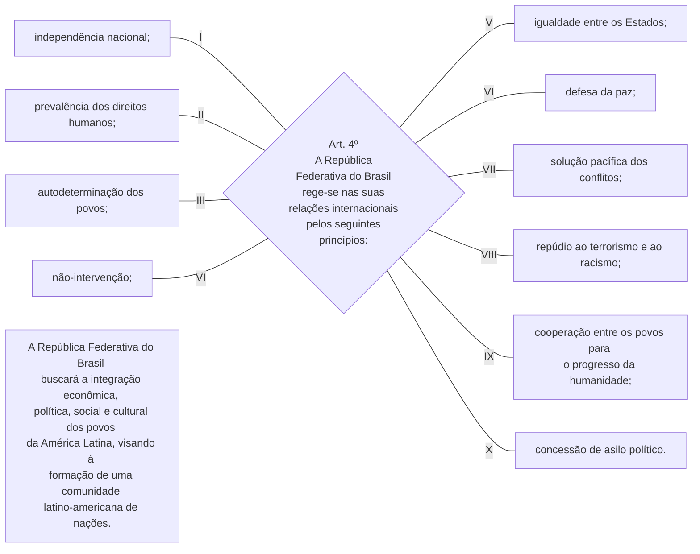

TÍTULO I

Dos Princípios Fundamentais 

Art. 1º A República Federativa do Brasil, formada pela união indissolúvel dos Estados e Municípios e do Distrito Federal, constitui-se em Estado Democrático de Direito e tem como fundamentos:

I - a soberania;

II - a cidadania

III - a dignidade da pessoa humana;

IV - os valores sociais do trabalho e da livre iniciativa; [(Vide Lei nº 13.874, de  2019)     ](http://www.planalto.gov.br/ccivil_03/_Ato2019-2022/2019/Lei/L13874.htm#art1)

V - o pluralismo político.

Parágrafo único. Todo o poder emana do povo, que o exerce por meio de representantes eleitos ou diretamente, nos termos desta Constituição.

Art. 2º São Poderes da União, independentes e harmônicos entre si, o Legislativo, o Executivo e o Judiciário.

Art. 3º Constituem objetivos fundamentais da República Federativa do Brasil:

I - construir uma sociedade livre, justa e solidária;

II - garantir o desenvolvimento nacional;

III - erradicar a pobreza e a marginalização e reduzir as desigualdades sociais e regionais;

IV - promover o bem de todos, sem preconceitos de origem, raça, sexo, cor, idade e quaisquer outras formas de discriminação. 

Art. 4º A República Federativa do Brasil rege-se nas suas relações internacionais pelos seguintes princípios:

I - independência nacional;

II - prevalência dos direitos humanos;

III - autodeterminação dos povos;

IV - não-intervenção;

V - igualdade entre os Estados;

VI - defesa da paz;

VII - solução pacífica dos conflitos;

VIII - repúdio ao terrorismo e ao racismo;

IX - cooperação entre os povos para o progresso da humanidade;

X - concessão de asilo político.

Parágrafo único. A República Federativa do Brasil buscará a integração econômica, política, social e cultural dos povos da América Latina, visando à formação de uma comunidade latino-americana de nações.

 

TÍTULO I

Dos Princípios Fundamentais 

 