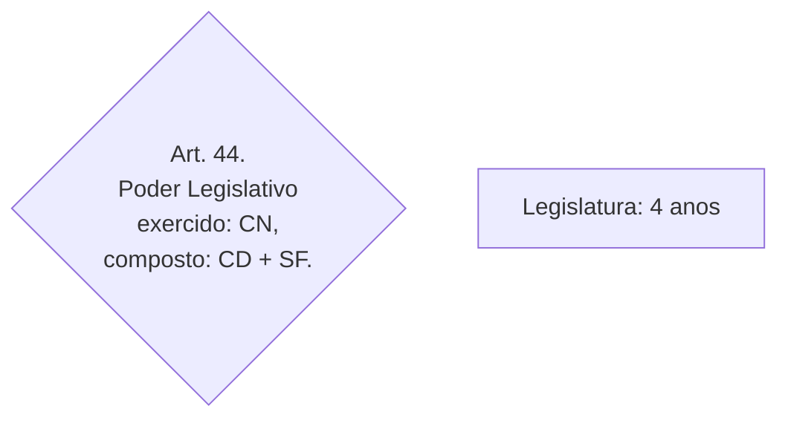
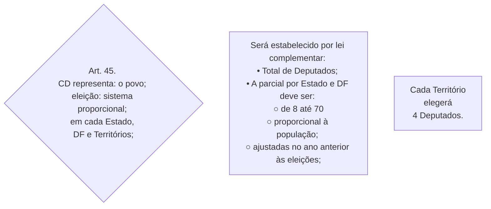
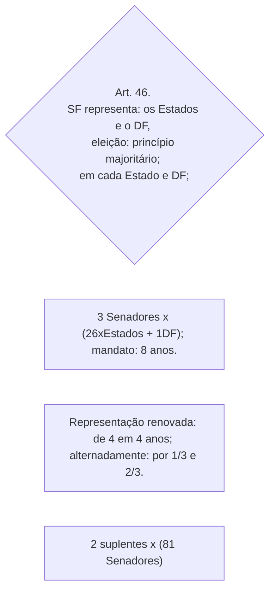
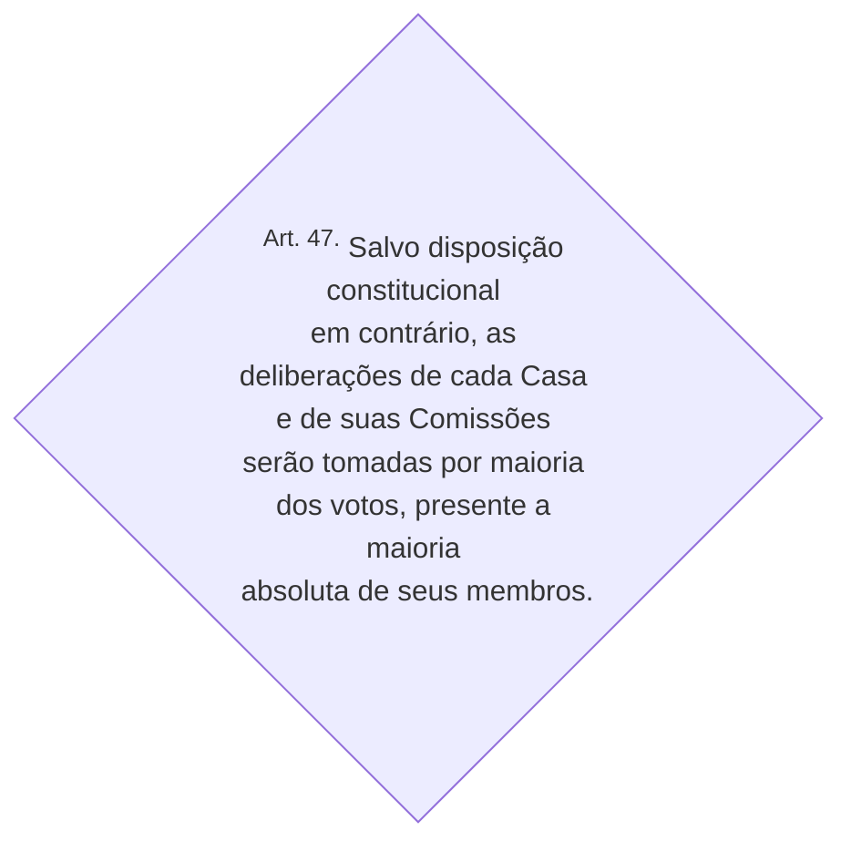

TÍTULO IV *DA ORGANIZAÇÃO DOS PODERES*

CAPÍTULO I *DO PODER LEGISLATIVO*

Seção I *DO CONGRESSO NACIONAL*

Art. 44. O Poder Legislativo é exercido pelo Congresso Nacional, que se compõe da Câmara dos Deputados e do Senado Federal. 

Parágrafo único. Cada legislatura terá a duração de quatro anos.

Art. 45. A Câmara dos Deputados compõe-se de representantes do povo, eleitos, pelo sistema proporcional, em cada Estado, em cada Território e no Distrito Federal.

§ 1º O número total de Deputados, bem como a representação por Estado e pelo Distrito Federal, será estabelecido por lei complementar, proporcionalmente à população, procedendo-se aos ajustes necessários, no ano anterior às eleições, para que nenhuma daquelas unidades da Federação tenha menos de oito ou mais de setenta Deputados.

§ 2º Cada Território elegerá quatro Deputados.

Art. 46. O Senado Federal compõe-se de representantes dos Estados e do Distrito Federal, eleitos segundo o princípio majoritário.

§ 1º Cada Estado e o Distrito Federal elegerão três Senadores, com mandato de oito anos.

§ 2º A representação de cada Estado e do Distrito Federal será renovada de quatro em quatro anos, alternadamente, por um e dois terços.

§ 3º Cada Senador será eleito com dois suplentes.

Art. 47. Salvo disposição constitucional em contrário, as deliberações de cada Casa e de suas Comissões serão tomadas por maioria dos votos, presente a maioria absoluta de seus membros.

[…]

|                                                              |                                                              |                                                              |                                         |
| ------------------------------------------------------------ | ------------------------------------------------------------ | ------------------------------------------------------------ | --------------------------------------- |
| ^Art.44.^  Poder Legislativo  exercido: CN,  composto: CD + SF. | ^PU^  Legislatura: 4 anos                                |                                                              |                                         |
| ^Art.45.^  CD representa: o povo;  eleição: sistema proporcional;  em cada Estado, DF e Territórios; | ^§1º^  Será estabelecido por lei complementar:  • Total de Deputados;  • A parcial por Estado e DF deve ser:    ○ de 8 até 70    ○ proporcional à população;    ○ ajustadas no ano anterior às eleições; | ^§2º^  Cada Território elegerá 4 Deputados.              |                                         |
| ^Art.46.^  SF representa: os Estados e o DF,  eleição: princípio majoritário;  em cada Estado e DF; | ^§1º^  3 Senadores x (26xEstados + 1DF);  mandato: 8 anos. | ^§2º^  Representação renovada: de 4 em 4 anos;  alternadamente: por 1/3 e 2/3. | ^§3º^  2 suplentes x (81 Senadores) |
| ^Art.47.^  Salvo disposição constitucional em contrário,  as deliberações  de cada Casa e de suas Comissões  serão tomadas por maioria dos votos,  resente a maioria absoluta de seus membros. |                                                              |                                                              |                                         |

**TÍTULO IV**

**DA ORGANIZAÇÃO DOS PODERES**

[(Redação dada pela Emenda Constitucional nº 80, de 2014)](http://www.planalto.gov.br/ccivil_03/constituicao/Emendas/Emc/emc80.htm#art1)

CAPÍTULO I

DO PODER LEGISLATIVO

**Seção I**

**DO CONGRESSO NACIONAL**

[…]

